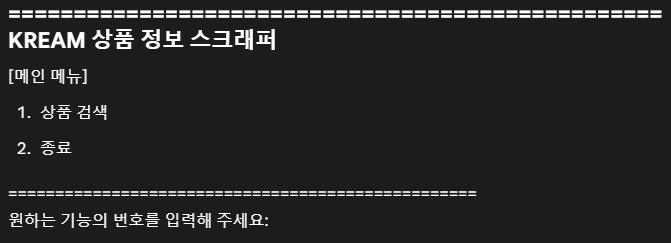

# KREAM 상품 정보 스크래퍼 (KREAM Product Information Scraper)

## 📜 프로젝트 소개 (Project Introduction)

이 프로젝트는 한국의 한정판 거래 플랫폼인 [KREAM (kream.co.kr)](https://kream.co.kr)에서 상품 정보를 스크래핑하는 Python 스크립트입니다. 사용자는 상품명을 검색하고, 선택적으로 키워드를 사용하여 결과를 필터링하여 브랜드, 상품명, 번역된 상품명, 가격, 상품 링크 등의 정보를 얻을 수 있습니다.

This project is a Python script designed to scrape product information from the South Korean limited edition trading platform, [KREAM (kream.co.kr)](https://kream.co.kr). Users can search for products by name and optionally filter the results using keywords to obtain information such as brand, product name, translated product name, price, and a direct link to the product page.

## ✨ 주요 기능 (Key Features)

* **상품 검색 (Product Search):** KREAM 웹사이트에서 특정 상품을 검색합니다.
* **동적 콘텐츠 로딩 (Dynamic Content Handling):** Selenium을 사용하여 JavaScript로 동적으로 로드되는 상품 정보를 가져옵니다. 페이지 스크롤을 통해 더 많은 상품을 로드합니다.
* **결과 필터링 (Result Filtering):** 사용자가 입력한 키워드를 기반으로 검색 결과를 필터링하여 원하는 정보만 표시합니다.
* **상세 정보 추출 (Detailed Information Extraction):** 각 상품에 대해 다음 정보를 추출합니다:
    * 브랜드 (Brand)
    * 상품명 (Product Name)
    * 번역 상품명 (Translated Product Name)
    * 가격 (Price)
    * 상품 페이지 링크 (Product Page Link)
* **사용자 친화적 인터페이스 (User-Friendly Interface):** 간단한 명령줄 인터페이스(CLI)를 통해 쉽게 사용할 수 있습니다.
* **헤드리스 브라우징 (Headless Browse):** 백그라운드에서 실행되도록 Chrome 브라우저를 헤드리스 모드로 실행합니다. (창이 뜨지 않음)

## ⚙️ 요구 사항 (Requirements)

* Python 3.x
* Google Chrome 브라우저
* ChromeDriver (사용 중인 Chrome 브라우저 버전과 호환되어야 함)
* 필요한 Python 라이브러리:
    * `beautifulsoup4`
    * `selenium`

## 🚀 설치 및 실행 (Installation and Execution)

1.  **Python 설치 (Install Python):**
    Python이 설치되어 있지 않다면 [python.org](https://www.python.org/)에서 다운로드하여 설치합니다.

2.  **Google Chrome 설치 (Install Google Chrome):**
    최신 버전의 Google Chrome 브라우저를 설치합니다.

3.  **ChromeDriver 다운로드 및 설정 (Download and Set Up ChromeDriver):**
    * [ChromeDriver 다운로드 페이지](https://chromedriver.chromium.org/downloads)에서 사용 중인 Chrome 브라우저 버전에 맞는 ChromeDriver를 다운로드합니다.
    * 다운로드한 `chromedriver.exe` (Windows) 또는 `chromedriver` (macOS/Linux) 파일을 Python 스크립트가 있는 디렉터리 또는 시스템 PATH에 추가된 디렉터리에 배치합니다.
        * *참고: 스크립트 코드에서 `driver = webdriver.Chrome(options=option_)` 부분을 사용하고 있으므로, ChromeDriver가 PATH에 설정되어 있거나 스크립트와 같은 디렉토리에 있어야 합니다. 특정 경로를 지정하려면 `webdriver.Chrome(service=Service(ChromeDriverManager().install()), options=option_)` 또는 `webdriver.Chrome(executable_path='/path/to/chromedriver', options=option_)` (구버전 Selenium)와 같이 수정할 수 있습니다.*

4.  **Python 라이브러리 설치 (Install Python Libraries):**
    터미널 또는 명령 프롬프트에서 다음 명령어를 실행하여 필요한 라이브러리를 설치합니다.
    ```bash
    pip install beautifulsoup4 selenium
    ```

5.  **스크립트 실행 (Run the Script):**
    터미널 또는 명령 프롬프트에서 스크립트가 있는 디렉터리로 이동한 후 다음 명령어를 실행합니다.
    ```bash
    python your_script_name.py
    ```
    (여기서 `your_script_name.py`는 제공해주신 파이썬 파일의 이름입니다.)

## 📝 사용 방법 (How to Use)

스크립트를 실행하면 다음과 같은 메인 메뉴가 나타납니다.

1.  **상품 검색 (Product Search):**
    * 메뉴에서 `1`을 입력하고 Enter 키를 누릅니다.
    * 검색할 상품명을 입력하라는 메시지가 나타납니다 (예: `슈프림`).
        ```
        [상품 검색]
        검색할 상품명을 입력해 주세요 (예: 슈프림): 슈프림
        ```
    * 스크립트가 KREAM에서 상품을 검색하고, 추가 상품을 로드하기 위해 스크롤합니다.
    * 검색 결과 중 특정 키워드로 필터링할지 묻는 메시지가 나타납니다. 필터링하지 않으려면 그냥 Enter 키를 누릅니다.
        ```
        [결과 필터링]
        검색 결과 중 출력할 상품명을 필터링할 키워드를 입력해 주세요 (예: 후드, 블랙).
        (비워두면 모든 검색 결과가 출력됩니다): 후드
        ```
    * 필터링된 (또는 전체) 검색 결과가 브랜드, 상품명, 번역 상품명, 가격, 링크 형식으로 출력됩니다.

2.  **종료 (Exit):**
    * 메뉴에서 `2`를 입력하고 Enter 키를 누르면 프로그램이 종료됩니다.

## 📄 코드 개요 (Code Overview)

* **`initialize_driver()`:** Selenium WebDriver (Chrome)를 헤드리스 모드로 초기화합니다. User-Agent를 설정하고 KREAM 기본 URL로 접속합니다.
* **`search_products()`:**
    * 사용자로부터 검색어와 필터링 키워드를 입력받습니다.
    * Selenium을 사용하여 KREAM 웹사이트에서 검색을 수행하고 동적으로 페이지를 스크롤하여 더 많은 상품을 로드합니다.
    * `BeautifulSoup`을 사용하여 HTML을 파싱하고 상품 정보를 추출합니다.
    * 추출된 정보를 필터링하여 콘솔에 출력합니다.
    * 상품을 찾지 못하거나 특정 정보(가격, 링크)가 없는 경우를 처리합니다.
* **`main_menu()`:** 사용자에게 메인 메뉴를 표시하고 선택에 따라 해당 기능을 호출합니다.
* **WebDriverWait:** 페이지 요소가 로드되거나 클릭 가능해질 때까지 명시적으로 대기하여 스크립트의 안정성을 높입니다.

## ❗ 참고 및 주의사항 (Notes and Caveats)

* KREAM 웹사이트의 구조가 변경되면 스크립트가 정상적으로 작동하지 않을 수 있습니다. 이 경우 CSS 선택자를 업데이트해야 합니다. (`.product_card`, `.brand-name` 등)
* 네트워크 상태나 웹사이트 응답 속도에 따라 스크롤 및 데이터 로딩 시간이 달라질 수 있습니다. `time.sleep()` 값이나 `WebDriverWait`의 타임아웃 값을 조절해야 할 수 있습니다.
* 과도한 요청은 대상 웹사이트에 부담을 줄 수 있으므로 적절한 간격으로 사용해야 합니다.
* 이 스크립트는 교육적 목적으로 제작되었으며, KREAM의 서비스 약관을 준수해야 합니다.

## 💡 향후 개선 사항 (Potential Future Improvements)

* GUI (Graphical User Interface) 추가 (예: Tkinter, PyQt)
* 추출된 데이터를 파일(CSV, Excel)로 저장하는 기능 추가
* 여러 페이지의 결과를 자동으로 가져오는 기능 개선
* 더욱 상세한 에러 로깅 기능
* 프록시 설정 기능 추가
* 정기적인 스크래핑을 위한 스케줄링 기능

---

*이 README는 제공된 Python 스크립트를 기반으로 작성되었습니다.*